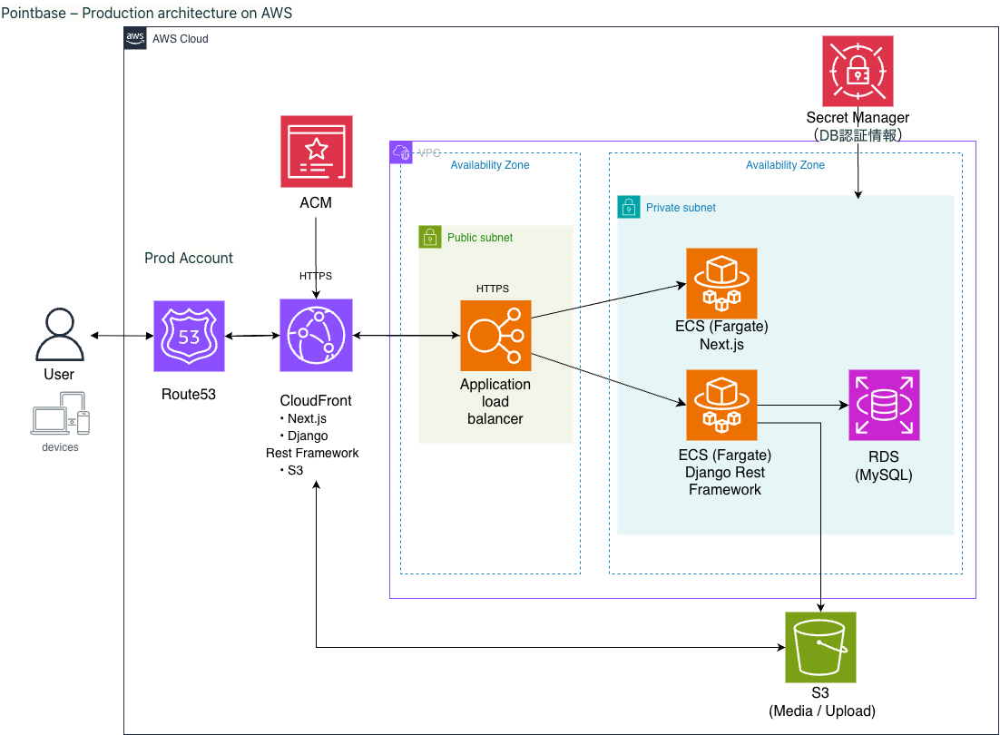

# PointBase

> 自分が運営するプログラミング教室（140名規模）の業務課題を解決するために開発した、ポイント・注文管理 Web アプリケーション。  
> フロントエンド・バックエンド・インフラまでを一人で設計・実装し、実教室でのプロトタイプ運用を経て改善を重ねた。

[](https://nextjs.org/)
[](https://www.django-rest-framework.org/)
[](https://aws.amazon.com/)

---

## デモ
   ← ログイン〜注文まで30秒程度のGIF

## スクリーンショット
| ダッシュボード | 注文管理 |
|---|---|
|  |  |

## 背景・課題

教室では生徒へのポイント付与・景品交換をスプレッドシートと手作業で管理していた。

- **管理者側**：ポイント集計・交換対応に毎回手間がかかる
- **生徒側**：自分の残高や交換状況をリアルタイムで確認できない

この課題を解決するため、業務アプリとして必要な「権限分離・状態遷移・セキュアな認証」を備えた Web アプリを設計・開発した。

---

## 主な機能

| 機能 | 概要 |
|------|------|
| 認証 | JWT（Access / Refresh）+ HttpOnly Cookie + CSRF 対策 |
| ポイント管理 | 付与・消費・残高確認 |
| カート・注文 | ポイント利用型カート → 注文作成 → ステータス管理 |
| 権限管理 | 管理者 / 一般ユーザーのロール分離 |
| 注文ステータス | 未交換（注文済み）→ 交換済み（管理者処理完了）|

---

## 技術スタック

### フロントエンド
- **Next.js**（App Router）/ TypeScript / Tailwind CSS
  - SSR・CSR を使い分けた認証フロー設計
  - localStorage を使わず Cookie ベースでトークン管理

### バックエンド
- **Django REST Framework**
  - JWT 認証（Access / Refresh トークン）
  - `/api/me/` によるサーバーサイドでの認証状態再検証
  - ロールベースの権限制御

### インフラ（AWS）
- ECS Fargate / ALB / CloudFront / RDS / S3 / IAM / WAF  
- GuardDuty / Security Hub / CloudTrail

---

## AWS マルチアカウント構成

AWS Organizations を前提とした 5 アカウント構成で設計。  
ログ・セキュリティ監視・本番環境を物理分離することで、侵害時の影響範囲を最小化している。

```
Management Account   ：組織管理・IAM Identity Center
Production Account   ：本番環境（ECS Fargate / RDS）
Security Account     ：GuardDuty / Security Hub / Config
Log Archive Account  ：CloudTrail・各種ログ集約
Development Account  ：検証環境
```


---

## アーキテクチャ

CloudFront をエントリーポイントとし、ALB 経由で Private Subnet 上の ECS Fargate に到達する構成。  
RDS は Private Subnet に配置し、アプリケーション経由以外のアクセスを遮断している。



---

## 認証・セキュリティ設計

「動くこと」より「安全に動くこと」を設計の起点とした。

### 認証フロー
1. ログイン時に Access Token / Refresh Token を発行
2. トークンは **HttpOnly + Secure Cookie** に保存（JS から直接取得不可）
3. 認証状態は `/api/me/` によりサーバー側で検証
4. CSRF トークンによる二重送信対策を実装

### インフラレベルのセキュリティ
- **CloudFront 経由のみ** ALB に到達可能な構成（直接アクセスを遮断）
- **AWS WAF** による不正リクエストフィルタリング
- **GuardDuty / Security Hub** による脅威検知・統合監視
- **CloudTrail** による全操作の監査ログ管理

---

## 設計上のこだわり

### なぜ HttpOnly Cookie か
localStorage にトークンを保存する実装は XSS 攻撃でトークンが盗まれるリスクがある。HttpOnly Cookie はブラウザの JavaScript からアクセスできないため、このリスクを根本から排除できる。

### なぜマルチアカウント構成か
単一アカウントでは、万が一本番環境が侵害されたときにログや監視データも失われるリスクがある。ログとセキュリティ監視を専用アカウントに分離することで、侵害時の証跡保全と影響範囲の局所化を実現している。

### 将来の Cognito 移行を見据えた設計
現在は DRF で JWT 認証を自前実装しているが、認証ロジックをサービス層から分離した構成にしており、Amazon Cognito への移行時に影響範囲を最小化できる設計にしている。

---

## 今後の改善予定

- [ ] Amazon Cognito への認証基盤移行
- [ ] Terraform によるインフラのコード化（IaC）
- [ ] RBAC の細分化
- [ ] CI/CD パイプライン整備（GitHub Actions）
- [ ] テストコード追加

---

## ディレクトリ構成

```
pointbase/
├── frontend/          # Next.js（App Router）
│   ├── app/
│   ├── components/
│   └── ...
├── backend/           # Django REST Framework
│   ├── api/
│   ├── authentication/
│   └── ...
└── infra/             # AWS 構成メモ・アーキテクチャ図
    └── images/
```

---

## 関連リンク

- GitHub: [mascarpone3110/pointbase_portfolio](https://github.com/mascarpone3110/pointbase_portfolio)
